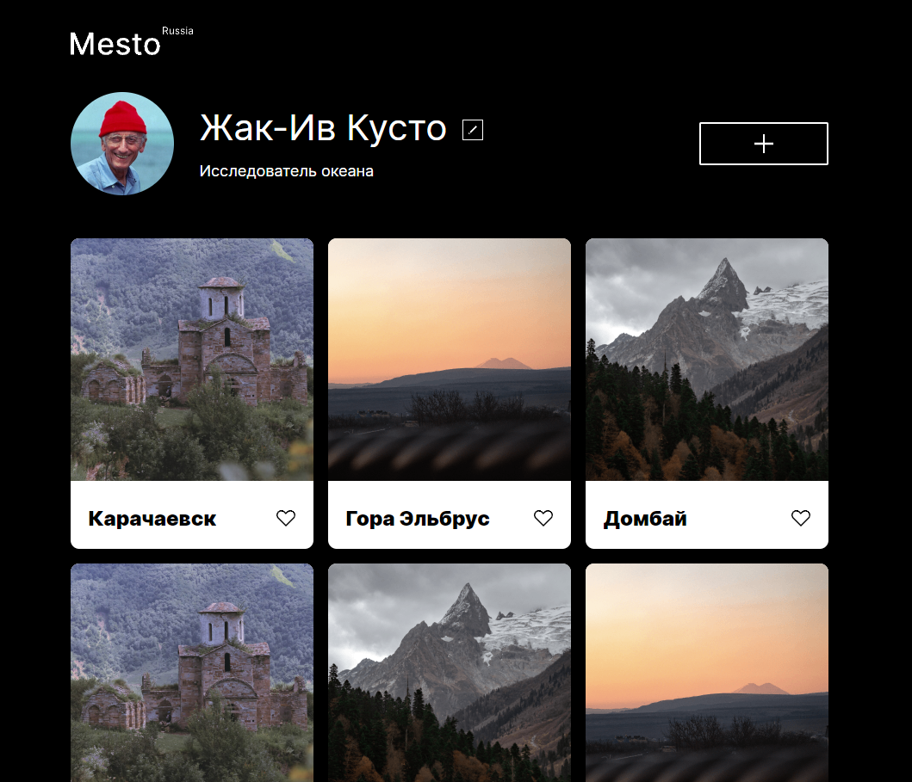
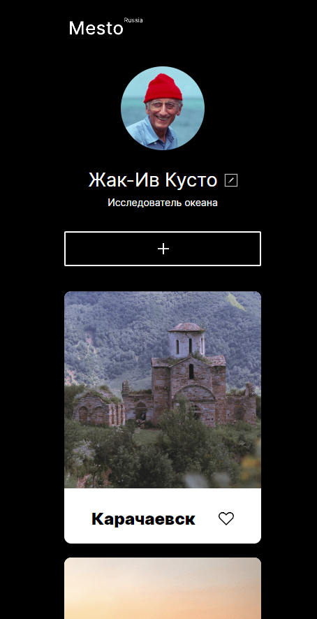
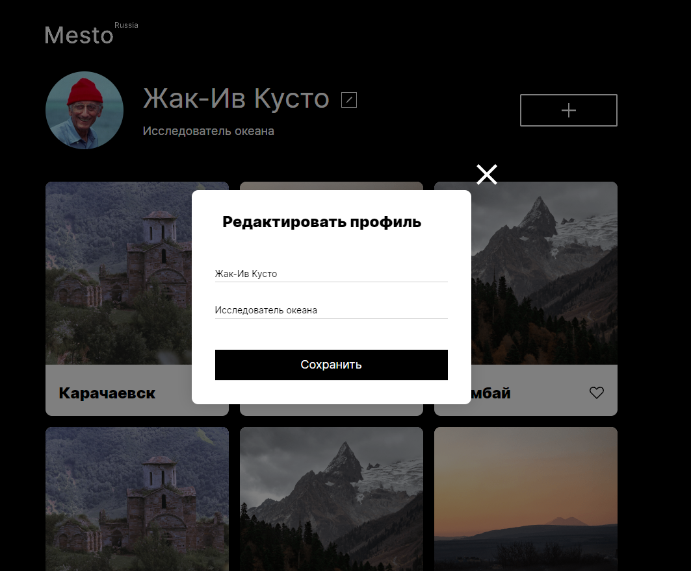
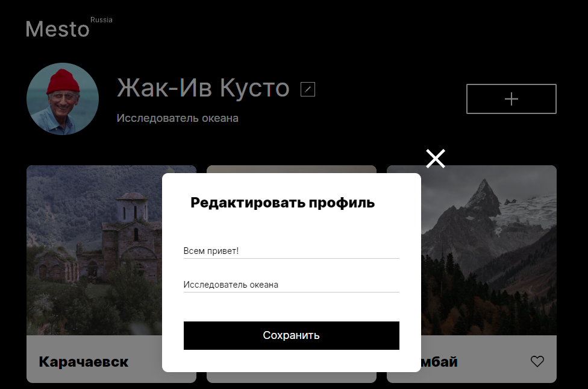
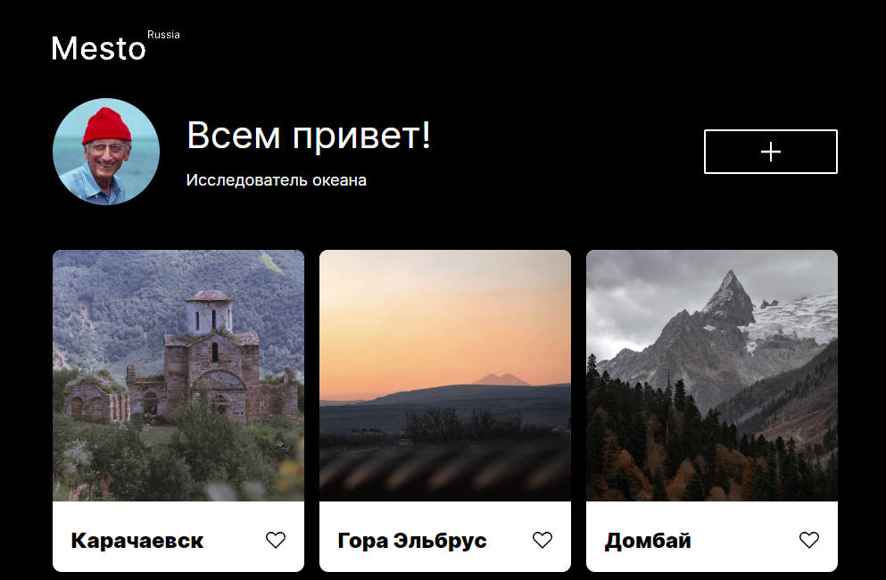

# Проект: Место

## Обзор

* Ссылка на готовую страницу GitHub Pages
* О проекте
* Макет в Figma
* Реализация

## **Ссылка на страницу**

[Mesto](https://roasterslav.github.io/mesto/)

## **О проекте**

Реализован учебный проект Яндекс.Практикум. Проект нацелен на закрепление знаний о модальных окнах и форм отправки

## **Figma**

* [Ссылка на макет в Figma](https://www.figma.com/file/2cn9N9jSkmxD84oJik7xL7/JavaScript.-Sprint-4?node-id=0%3A1)

## **Реализация**

#### Вёрстка соответствует брифу. Сайт поддерживает два разрешения экрана: для мобильных и десктопных устройств

 

 

## "Popup"
 
Модальное окно добавлено на страницу и "спрятано" с помощью display: none;

Чтобы его вызвать, кнопка "редактировать" слушает "click" и с помощью метода "Element.classList" добавляет к модальному окну заранее прописанный модификатор, который меняет значение "display" и делает элемент блочным, а значит видимым.

 

## Форма отправки
 
Редактируем данные в модальном окне. Например, можно поздороваться с ревьюерами 

 

 

Результат сохраняется в профиле с помощью Text.Content

 

 

## Спасибо за внимание!